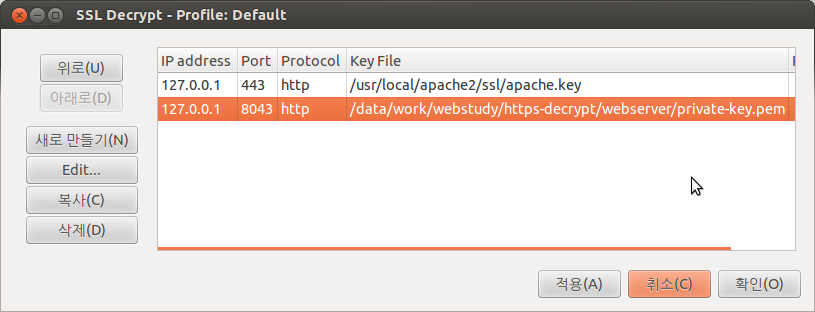

# HTTPS packet decrypt example by mongoose and openssl

## Environment

* Ubuntu 12.04 LTS 64bit
* mongoose (commit c8e88e1710a1e20a0540f31c0a2897fa1d6aa480, 2015-05-16)

## Prepare HTTPS server, private key, certificate

Run the following script.

```
$ ./build-mongoose-webserver.sh
```

Then, it will clone mongoose code and build mongoose webserver and copy create several files.

```
.
├── build-mongoose-webserver.sh
├── doc
├── mongoose
└── webserver
    ├── cert.pem          # certificate and private key for mongoose
    │                          ,copied from mongoose web_server example
    ├── private-key.pem   # private key for wireshark to decrypt packets
    │                          ,derived from mongoose web_server example
    └── web_server        # mongoose webserver binary
```

## Set Wireshark

- Run wireshark
- Goto SSL setting Edit > Perferences > Protocols > SSL
- Add 'private-key.pem' to RSA keys list




# Run mongoose HTTPS Server

`./web_server -listening_port ssl://8043:cert.pem`

```
$ ./web_server -listening_port ssl://8043:cert.pem
Mongoose web server v.5.6 serving [/data/work/webstudy/https-decrypt/webserver/web_server] on port ssl://0.0.0.0:8043:cert.pem
```

## Start HTTPS packet capture

Start to capture packets on the HTTPS port above; 8043


## Capture HTTPS packets

### Run OpenSSL as HTTPS client

`printf 'GET / HTTP/1.0\r\n\r\n' | openssl s_client -connect 127.0.0.1:8043 -ssl3 -ign_eof`

```
$ printf 'GET / HTTP/1.0\r\n\r\n' | openssl s_client -connect 127.0.0.1:8043 -ssl3 -ign_eof
CONNECTED(00000003)
depth=0 CN = 127.0.0.1
verify error:num=18:self signed certificate
verify return:1
depth=0 CN = 127.0.0.1
verify return:1
---
Certificate chain
 0 s:/CN=127.0.0.1
   i:/CN=127.0.0.1
---
Server certificate
-----BEGIN CERTIFICATE-----
MIIC+zCCAeOgAwIBAgIJAPhB8jbL+G82MA0GCSqGSIb3DQEBCwUAMBQxEjAQBgNV
BAMMCTEyNy4wLjAuMTAeFw0xNTAzMDYxMjQzMzNaFw0yNTAzMDMxMjQzMzNaMBQx
EjAQBgNVBAMMCTEyNy4wLjAuMTCCASIwDQYJKoZIhvcNAQEBBQADggEPADCCAQoC
ggEBALi3b3daMgzUEROKob1Caf68i+//cTRkPdBJv2cOBak21CdQzY0Nvx73GLzf
5TKB347BCHNbYRKGJXDbYdmFp20/WeBHkY7RS3Ad2Q5lzyx66u9PxNx7hJIiqBgF
58VU+E3o/I+o8QNIoOT+wtCiq3Nwkp+zGBJmS32rzMEV9bcKxSzMrkfRhF+XAREd
DwM9vfPg6WRb/b+vv06uvVwcw390RprLautGfBdaRddVYkIAKJGRRTqZAvTRFW1J
FcIVOxlN+iA7qP7xjr3tUP78qMmlu0MXsHrUR2cgfveZK2sdUW5G804yHsU5sC8l
FbtLKMEOyLsk2bEIScOXgum7g2sCAwEAAaNQME4wHQYDVR0OBBYEFHtLzUqAsXkH
Il8S5sMhJuVhRJLdMB8GA1UdIwQYMBaAFHtLzUqAsXkHIl8S5sMhJuVhRJLdMAwG
A1UdEwQFMAMBAf8wDQYJKoZIhvcNAQELBQADggEBAEzHc0AOr+qs0OFvWMfcSMi7
O/aYlLS6f7Sos+lli69+61EcmCTJVarVeAVUsAoqmzBKDbeOpAK1hGX6/GGcXjR2
BmuU0hUKyX9l1lwdMKU45BayH/riElwnvAyj2GxKoPpdIjlHns4SAITOCUx9NfpM
agd7kjolton0ZQ5DI/2a43PkqHv1lY4Dp60wJlxit9U68bsGOycCJ/BsAyrPROb2
D1MkpMBIdfHc8uxRywM3/l9buFX8yrrMUGOYKgfjDwdzbj0iwIixoGpHL7IfeBtu
dvGO/g2rEhbtAP+xIgOR3GvzqjZh30er3no7zjDMn65tTME18Aq3tBQY7vPDKms=
-----END CERTIFICATE-----
subject=/CN=127.0.0.1
issuer=/CN=127.0.0.1
---
No client certificate CA names sent
---
SSL handshake has read 952 bytes and written 478 bytes
---
New, TLSv1/SSLv3, Cipher is AES256-SHA
Server public key is 2048 bit
Secure Renegotiation IS supported
Compression: NONE
Expansion: NONE
SSL-Session:
    Protocol  : SSLv3
    Cipher    : AES256-SHA
    Session-ID: 0A764DE375221616FD1ED413E02A36031C06F6A55ADD62808223C7E3A11DEEEC
    Session-ID-ctx: 
    Master-Key: 9D77EAB3515F9A3EBDA004C3BBF8A7492C880F1C784B997D712E210077D68A78F0D381FC66FEE02D7D7FCB3E64E602E5
    Key-Arg   : None
    PSK identity: None
    PSK identity hint: None
    SRP username: None
    Start Time: 1431924152
    Timeout   : 7200 (sec)
    Verify return code: 18 (self signed certificate)
---
HTTP/1.1 200 OK
Transfer-Encoding: chunked
Content-Type: text/html; charset=utf-8
Transfer-Encoding: chunked

112
<html><head><title>Index of /</title><style>th {text-align: left;}</style></head><body><h1>Index of /</h1><pre><table cellpadding="0"><tr><th><a href="?nd">Name</a></th><th><a href="?dd">Modified</a></th><th><a href="?sd">Size</a></th></tr><tr><td colspan="3"><hr></td></tr>
6E
<tr><td><a href="certs/">certs/</a></td><td>&nbsp;18-May-2015 13:40</td><td>&nbsp;&nbsp;[DIRECTORY]</td></tr>

6A
<tr><td><a href="Makefile">Makefile</a></td><td>&nbsp;18-May-2015 13:17</td><td>&nbsp;&nbsp;875</td></tr>

71
<tr><td><a href="web_server">web_server</a></td><td>&nbsp;18-May-2015 13:34</td><td>&nbsp;&nbsp;221.4k</td></tr>

74
<tr><td><a href="web_server.c">web_server.c</a></td><td>&nbsp;18-May-2015 13:17</td><td>&nbsp;&nbsp;13.8k</td></tr>

0

read:errno=0
```

### Run wget as HTTPS client

`wget -O- https://127.0.0.1:8043 --no-check-certificate`

```
$ wget -O- https://127.0.0.1:8043 --no-check-certificate
--2015-05-18 16:21:47--  https://127.0.0.1:8043/
WARNING: cannot verify 127.0.0.1's certificate, issued by `/CN=127.0.0.1':
  Self-signed certificate encountered.
HTTP request sent, awaiting response... 200 OK
Length: unspecified [text/html]
Saving to: `STDOUT'

    [<=>                                                                                        ] 0           --.-K/s              <html><head><title>Index of /</title><style>th {text-align: left;}</style></head><body><h1>Index of /</h1><pre><table cellpadding="0"><tr><th><a href="?nd">Name</a></th><th><a href="?dd">Modified</a></th><th><a href="?sd">Size</a></th></tr><tr><td colspan="3"><hr></td></tr><tr><td><a href="certs/">certs/</a></td><td>&nbsp;18-May-2015 13:40</td><td>&nbsp;&nbsp;[DIRECTORY]</td></tr>
<tr><td><a href="Makefile">Makefile</a></td><td>&nbsp;18-May-2015 13:17</td><td>&nbsp;&nbsp;875</td></tr>
<tr><td><a href="web_server">web_server</a></td><td>&nbsp;18-May-2015 13:34</td><td>&nbsp;&nbsp;221.4k</td></tr>
<tr><td><a href="web_server.c">web_server.c</a></td><td>&nbsp;18-May-2015 13:17</td><td>&nbsp;&nbsp;13.8k</td></tr>
    [ <=>                                                                                       ] 719         --.-K/s   in 0s      

2015-05-18 16:21:47 (15.2 MB/s) - written to stdout [719]
```

## Decrypt packets between Firefox and Mongoose

* Open `about:config`
* Type `ssl3`, and change cipher options to false without aes_265_sha
* Type `tls.version`, and change tls.version.max to 2


* Run mongoose HTTPS server on port 8043
* Capture `loopback interface on port 8043`
* Open `https://127.0.0.1:8043`


Severak TLS extensions are shown.


Decrypted TLS packets are shown.

## Appendix

* Captured HTTPS packets
    * [mongoose-https-serv-openssl-client-20150518.pcap](doc/mongoose-https-serv-openssl-client-20150518.pcap)
* Captured HTTPS packets, Success to decrypt
    * [mongoose-https-serv-firefox-mod-client-20150519.pcap](doc/mongoose-https-serv-firefox-mod-client-20150519.pcap)
* Captured HTTPS packets, Fail to decrypt
    * [mongoose-https-serv-firefox-client-20150518.pcap](doc/mongoose-https-serv-firefox-client-20150518.pcap)


### Decrypt Faiulre

Packets between Firefox and mongoose HTTPS server cannot be decrypted without modification on Firefox ssl cipher options.


## Reference

* Wireshark setup Linux for nonroot user
    * https://ask.wireshark.org/questions/7976
* Mongoose SSL option
    * `mongoose -listening_port ssl://8043:ssl_cert.pem`
    * https://github.com/cesanta/mongoose/blob/master/docs/Options.md
    * https://github.com/cesanta/mongoose/blob/master/docs/SSL.md
